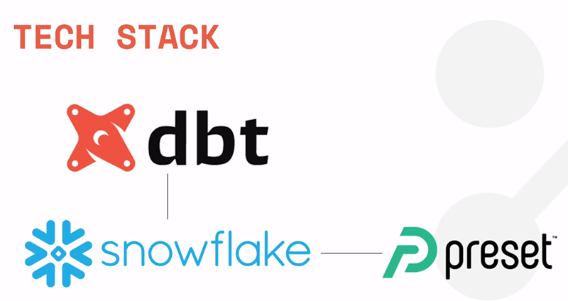

# dbt
dbt Labs is a cloud-based platform that helps you ship trusted data products faster by empowering your team with a workflow that supports data engineering, business logic, and data quality.

## Problem Statement:

As an Analytics Engineer tasked with managing the data flow for Airbnb in Berlin, Germany, and Europe, the primary goal is to establish a robust data pipeline and warehouse infrastructure to facilitate efficient data processing, transformation, and analytics. The focus is on ensuring the reliability, integrity, and quality of the data while optimizing for scalability and ease of maintenance.

Key Tasks:

1. Import Data into Data Warehouse:
- Import Airbnb data from the provided source into Snowflake data warehouse.
- Ensure the data is properly formatted and ready for analysis.

2. Prepare Data for Analysis Tools:
- Make the imported data accessible for tools like DVT (Data Visualization Tool).
- Configure connectivity between Snowflake and DVT for seamless data visualization.

3. Data Cleansing and Transformation:
- Perform data cleansing to eliminate inconsistencies and errors.
- Implement necessary transformations on the data to meet analytical requirements.
- Ensure data is formatted correctly for export and analysis.

4. Export Data to External Tools (e.g., FBI):
- Export transformed data to external tools such as the Federal Bureau of Investigation (FBI) for analysis.
- Pipeline Development and Testing:

5. Develop a robust data pipeline architecture.
- Ensure the pipeline is well-tested to handle various scenarios and edge cases.
- Implement monitoring mechanisms to track pipeline performance and data quality.
- Establish alerting systems for detecting and addressing pipeline errors or anomalies.

6. Version Control and Collaboration:
- Implement version control for the pipeline code to track changes and facilitate collaboration.
- Ensure the pipeline code is well-documented for ease of understanding and maintenance.

7. Dependency Management:
- Define explicit dependencies between pipeline components to ensure correct execution order.
- Implement features for easy exploration and overview of dependencies.

8. Additional Requirements:
- Handle incremental updates for event-based tables to efficiently manage new data.
- Implement mechanisms for managing slowly changing dimensions to maintain historical data integrity.

9. Setup and Configuration:
- Guide users through the setup process, including Snowflake registration and DVT installation.
- Provide tutorials for installing DVT on both Windows and Mac platforms.

10. Readiness for Analytics:
- Ensure the data infrastructure is optimized for analytics and meets the specific requirements outlined.
- Prepare the environment for advanced analytics tasks and business logic development.

## Tech Stack used:

## dbt project structure (Terms you should know):
### Models:

### Common Table Expression (CTE)

### Materialization

### Sources and Seeds
